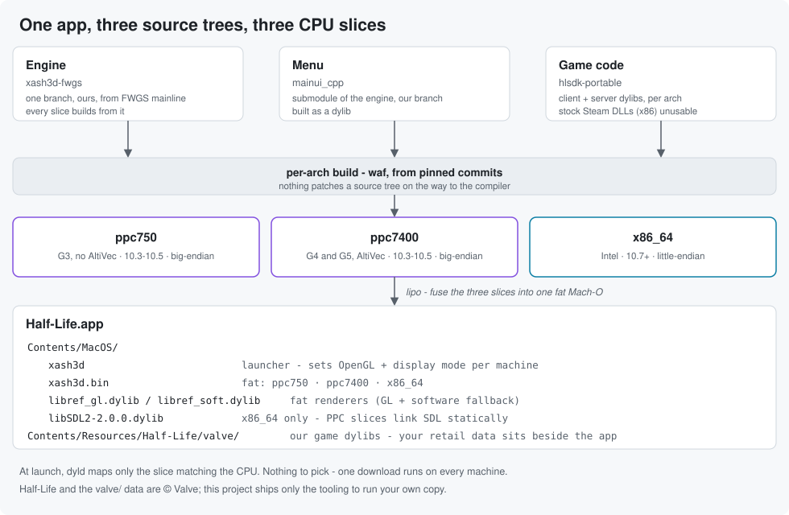
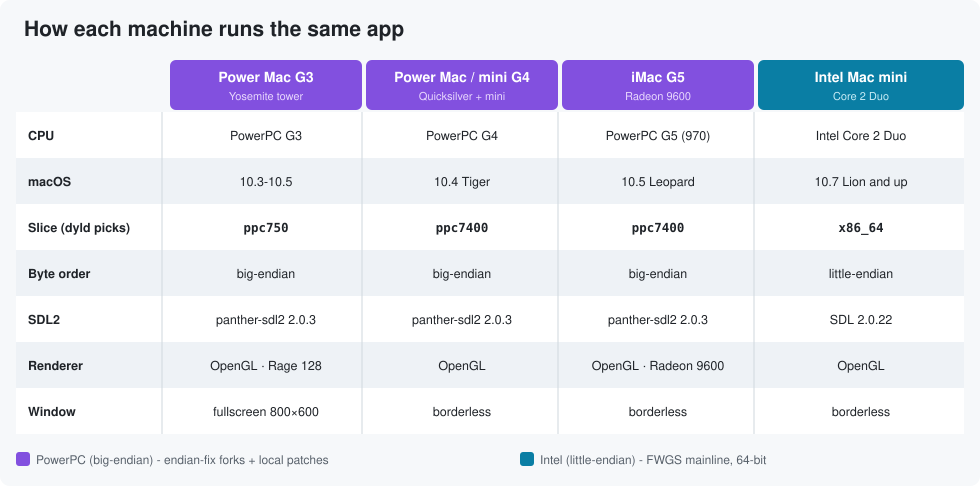
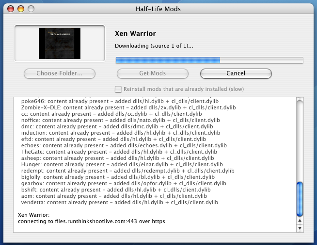
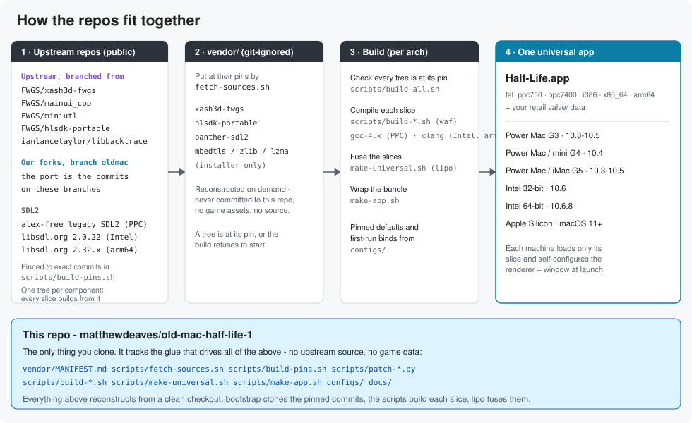

# Half-Life on old Macs

Half-Life 1 for PowerPC, Intel and Apple Silicon Macs as one universal
`Half-Life.app`, using the open-source
[Xash3D FWGS](https://github.com/FWGS/xash3d-fwgs) engine in place of the retail
GoldSrc one. One download runs on everything from a 1999 G3 on Mac OS X 10.3.9
to an M-series Mac on macOS 26, configures itself for the machine it lands on,
and plays 25 Half-Life mods as well as the base game.

- **Mac OS X and macOS only, 10.3.9 up.** Not Mac OS 9 / Classic.
- **No game content.** This ships engine and tooling only; you supply your own
  retail `valve/` folder.
- **Independent repackaging**, not affiliated with any project it builds on.
  Report problems
  [here](https://github.com/matthewdeaves/old-mac-half-life-1/issues), never on
  an upstream release page.

## Install

1. Download the `.dmg` from the
   [**Releases page**](https://github.com/matthewdeaves/old-mac-half-life-1/releases/latest).
2. Copy `Half-Life.app` out of it into any folder.
3. Put your retail `valve/` folder beside it, exactly as it came off your copy.

On macOS Catalina and later, pick a folder outside Desktop, Documents and
Downloads: `/Applications` or your home folder both work. Those three folders
are privacy-gated per app, and an unsigned app has its writes silently denied
there, so the game cannot save. The launcher explains this if it happens. On
Mac OS X 10.3 through 10.14 any folder works, the Desktop included.

That is the whole install. Nothing is merged: everything this project builds
lives inside the app, and saves and settings are written to your folder, so a
newer build swaps in without losing anything. Tested against the retail Game of
the Year `valve/`; a Steam install's works the same. It needs at least
`liblist.gam`, `pak0.pak`, the `.wad` files and the
`maps/ models/ sound/ sprites/ gfx/` directories.

## Which Macs

| CPU | macOS | Slice |
|---|---|---|
| G3 (PowerPC 750) | 10.3.9, 10.4 | `ppc750` |
| G4 (PowerPC 7400 / 7450) | 10.4 | `ppc7400` |
| G5 (PowerPC 970) | 10.3.9 through 10.5 | `ppc7400` |
| Intel, 32-bit (Core Solo / Core Duo) | 10.6 | `i386` |
| Intel, 64-bit | 10.6.8 and up | `x86_64` |
| Apple Silicon | macOS 11 and up | `arm64`, native |

`dyld` picks a slice by CPU capability alone, never by OS, so a slice exists
only where the instruction set differs: the G3 has no AltiVec unit, the G4 and
G5 do. Why these five, and why each PowerPC slice carries its exact CPU subtype:
[docs/adr/0001](docs/adr/0001-slices-are-chosen-by-cpu-capability.md).

Untested, only for lack of a machine set up that way: a G4 on 10.3.9, a G3 on
10.5, and the PowerPC builds of 10.6. Each should take its existing slice; a
report either way is
[useful](https://github.com/matthewdeaves/old-mac-half-life-1/issues).

## The three apps

The disk image carries three applications. Each is one universal binary that
runs natively on every CPU above.

### Half-Life.app

The game. Every machine renders with **hardware OpenGL**, from the G3's ATI
Rage 128 up, with the software renderer as automatic fallback; the world is
drawn in a single multitexture pass, worth about **30% more frames** on the
fillrate-bound G3. The launcher picks a display mode per machine: the G3 gets
exclusive fullscreen at 800x600, a fillrate decision about its Rage 128; every
other PowerPC Mac gets borderless at its desktop resolution; Intel and Apple
Silicon get exclusive fullscreen at the desktop resolution. A config shipped
inside the app re-applies renderer-safe defaults on every launch, and the
console is available everywhere without developer mode.

LAN multiplayer works across the endian boundary: PowerPC and Intel machines
host and join each other.

### Half-Life Mods.app

Installs the 25 supported mods: They Hunger, Poke 646, Echoes, Residual Point,
Blue Shift, Opposing Force and the rest. **Get Mods** first adds game code to
any mod folders already beside `Half-Life.app`, then fetches everything with a
public release, each mod from wherever its author published it, verified by
checksum. We host no content. Installed mods appear under **Custom Game** in
the main menu with artwork and a description.

A mod is content, the authors' maps, models and sounds, plus the game code that
drives it, and only the code, about 3% of the bulk, needs rebuilding for these
machines. Each mod's code is built from its own
[hlsdk-portable](https://github.com/FWGS/hlsdk-portable) branch as a fat
`ppc + i386 + x86_64 + arm64` dylib pair, so one file serves every machine.
Team Fortress Classic is the one exception: no open server implementation
exists for GoldSrc, so there is nothing to rebuild.

Details: [the installer's README](installer/README.md),
[docs/MODS.md](docs/MODS.md) to build the dylibs yourself, and
[docs/MOD-AUDIT.md](docs/MOD-AUDIT.md) for the source audit.

### Half-Life System Report.app

Run it if the game will not launch. It says what your Mac is and which slice
the game would load, and copies that to the clipboard in one press to paste
into an [issue](https://github.com/matthewdeaves/old-mac-half-life-1/issues).
It reads only and sends nothing. Its floors are deliberately lower than the
game's, PowerPC 10.3, `i386` 10.4, `x86_64` 10.5, native `arm64`, so a machine
the game refuses can still say why. [docs/adr/0010](docs/adr/0010-the-system-report-app-targets-lower-floors-than-the-game.md)

## Upstream

Half-Life splits into three separately built parts, and all three are other
people's code. The port is carried as commits on the `oldmac` branch of our own
fork of each, so

    git log --oneline <upstream>..oldmac

in any of them is exactly what this project changed and nothing else. Every
slice builds from the same branch of each tree; there is no separate PowerPC
tree. Exact pins: [`scripts/build-pins.sh`](scripts/build-pins.sh) and
[`vendor/MANIFEST.md`](vendor/MANIFEST.md).

| Project | Used for |
|---|---|
| [`FWGS/xash3d-fwgs`](https://github.com/FWGS/xash3d-fwgs) | the engine, all five slices |
| [`FWGS/mainui_cpp`](https://github.com/FWGS/mainui_cpp) | the menu |
| [`FWGS/miniutl`](https://github.com/FWGS/miniutl) | the menu's containers |
| [`FWGS/hlsdk-portable`](https://github.com/FWGS/hlsdk-portable) | game code, and the source of all 25 mods |
| [`ianlancetaylor/libbacktrace`](https://github.com/ianlancetaylor/libbacktrace) | crash backtraces |
| [alex-free legacy SDL2](https://forums.macrumors.com/threads/2262878/) | SDL2 for the PowerPC slices; modern SDL2 refuses to build pre-10.6 |
| [Mbed-TLS](https://github.com/Mbed-TLS/mbedtls), [zlib](https://github.com/madler/zlib), [7-Zip](https://github.com/ip7z/7zip) | the mod installer only, never the engine |

## How it is built

Development is an automated AI loop, Claude Code under my direction: implement,
build, deploy to real hardware, run it there, iterate. Every change is compiled
on an Intel Lion mini, where all the PowerPC and Intel slices cross-compile,
plus an Apple Silicon box for `arm64`, fused with `lipo` and tested on the
machines below rather than on an emulator. Findings that turned out wrong are
recorded as wrong in
[docs/port/POWERPC-FINDINGS.md](docs/port/POWERPC-FINDINGS.md).

No upstream source and no game data is committed here. Upstream is cloned at
pinned commits into a git-ignored `vendor/` and built; what this repo tracks:

- `scripts/` per-slice build drivers, slice fusing, app packaging, DMG
  packaging, fleet deploy and benchmarking
- `installer/` the Mods app ([its own README](installer/README.md))
- `sysreport/` the System Report app
- `configs/` sticky per-machine settings
- `docs/` decision records (`docs/adr/`), [mods](docs/MODS.md),
  [benchmarking](docs/BENCHMARKING.md), [icons](docs/ICONS.md), a
  [renderer case study](docs/GL-OPTIMIZATION-CASE-STUDY.md)

### Tested on

The only setups this has run on.

| Machine | CPU | GPU | macOS |
|---|---|---|---|
| Power Mac G3 (Yosemite) | PowerPC 750 @ 450 MHz | ATI Rage 128 | 10.3.9 and 10.4.11, two partitions |
| Power Mac G4 (Quicksilver) | PowerPC 7450 @ 733 MHz | ATI Radeon 9000 | 10.4.11 |
| Mac mini G4 | PowerPC 7450 @ 1.25 GHz | ATI Radeon 9200 | 10.4.11 |
| iMac G5 | PowerPC 970 @ 2.0 GHz | ATI Radeon 9600 | 10.5.8 |
| Power Mac G5 (dual 2.7 GHz) | 2x PowerPC 970 @ 2.7 GHz | ATI Radeon 9650 | 10.3.9, 10.4.11 and 10.5.8, three partitions |
| Mac mini (Intel) | Core 2 Duo @ 2.33 GHz | Intel GMA 950 | 10.7.5 |
| Mac mini (Intel) | Core 2 Duo @ 2.26 GHz | NVIDIA GeForce 9400 | 10.6.8 |
| MacBook Air (M5) | Apple M5 | Apple integrated | macOS 26, native `arm64` |

Benchmarks and per-machine notes: [docs/BENCHMARKING.md](docs/BENCHMARKING.md).

## Credits

- **[FWGS](https://github.com/FWGS)**: the Xash3D engine, the menu and the
  portable Half-Life SDK, which are what this builds on.
- **[alex-free](https://github.com/alex-free)**: the
  [legacy native-Cocoa SDL2](https://forums.macrumors.com/threads/2262878/)
  the PowerPC slices link.
- **[Ian Lance Taylor](https://github.com/ianlancetaylor)**: libbacktrace.
- **[Mbed-TLS](https://github.com/Mbed-TLS/mbedtls)**,
  **[zlib](https://github.com/madler/zlib)**,
  **[7-Zip](https://github.com/ip7z/7zip)**: the mod installer's fetching and
  unpacking, on OS versions whose own TLS cannot reach modern servers.
- **The authors of all 25 mods**: the maps, models and sounds are their work;
  this project supplies game code and no content.
- **[runthinkshootlive.com](https://www.runthinkshootlive.com)** and
  **[archive.org](https://archive.org)**: keeping those releases downloadable
  decades on.

Half-Life and the `valve/` game data are © Valve, and this ships neither.
Gordon Freeman is Valve's character. The game icon is an AI-edited derivative
of Little Red Zombies' "HλLF-LIFE: Gordon (UE4)" MetaHuman render; the mod
installer's icon and About picture are AI-generated images made for this
project. An unofficial fan project, not endorsed by Valve; any of this artwork
comes out or gets replaced on request.

## License

The code in this repository is under the [GPLv3](LICENSE), the same license as
the Xash3D FWGS engine it builds. What that covers here, including the artwork
and the vendored trees, is in [`docs/LICENSING.md`](docs/LICENSING.md).

## More old-Mac game builds

The same one-universal-binary treatment, applied to other engines:
[**Quake**](https://github.com/matthewdeaves/old-mac-quakespasm) (QuakeSpasm),
[**Quake II**](https://github.com/matthewdeaves/old-mac-quake2) (yquake2) and
[**Quake III Arena**](https://github.com/matthewdeaves/old-mac-quake3) (ioquake3).
